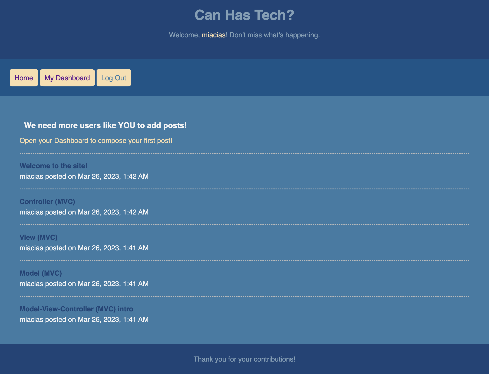

# Tech Blog

model-view-controller forum site for publishing and commenting on blog posts

## Description

This is a complete blog site for any and all tech related thoughts and aspirations. One of the main functions of the web is to connect humans of the world to resources, knowledge, and social circles that may otherwise be physically inaccessible due to distance. This blog site offers tech gurus to share their wealth of knowledge, for developers to discuss their discoveries, and for those interested in technology to find inspiration and hopefully an entry point into the world of tech.

This project was a rush to complete all components in one week! It was valuable to practice front-to-back connections via fetch requests and database queries. As an introduction to the Model-View-Controller format, it is clear that each element plays an important role, and without it, a website or web app would not be able to serve anything more than a surface-level purpose.

## Table of Contents
- [Installation](#installation)
- [Usage](#usage)
- [Roadmap](#roadmap)
- [Contribution](#contribution)
- [Tests](#tests)
- [Contact](#contact)
- [Credits](#credits)
- [License](#license)

## Installation

N/A. [Deployed site here!](https://quiet-woodland-50300.herokuapp.com/)

## Usage

The opening screen welcomes users to engage in the site by adding a post. After adding a new account and returning to the home page, enter the Dashboard to then add your first post. Other users on the site will be able to leave thoughts on your post. Return to the home page to see the list of blogs available for perusal. Select one by its title to read more.

## Roadmap

Content will be added and adjusted as new coding projects are available! Some projects may phase out over time as my work becomes more specialized. Some desired features and functionality to be added in the future:
- ensure mobile-friendly responsive view using Bootstrap classes and breakpoints

## Contribution

Not currently accepting contributions. Thank you for your interest!

## Tests

Testing not provided at this time.

## Contact

- creator: [miacias](https://github.com/miacias)
- email: [miaciasullo@gmail.com](mailto:miaciasullo@gmail.com)

## Credits

Documentation referenced:

- Mozilla Developer Network (MDN)
- Stack Overflow Forums
- W3 Schools
- Sequelize
- Heroku
- JAWSDB

Tools used:

- [VS Code](https://code.visualstudio.com/)
- [Node.js](https://nodejs.org/en/)
- [MySQL](https://www.mysql.com/)

U. Penn Bootcamp instructor(s): 

- [Dan Gross](https://github.com/DanielWGross) - Handlebars.js helpers
- [Andrew Hojnowski](https://github.com/aHojo)
- [C. Ross King](https://github.com/RomeoKilo125/) - seeding the database

Tutor(s): 

- [Sangeetha Kaliaperumal](https://www.linkedin.com/in/sangeetha-kaliaperumal/) - front-end to back-end routes

U. Penn Bootcamp study groups:

- [Alex Weiss](https://github.com/alexander1262)
- [Josh Eflin](https://github.com/JoshEflin)

Artist(s):

- [shellybean86](https://www.colourlovers.com/palette/4901956/Horizontal_Blues) - Horizontal Blues color palette

## License

Please refer to the LICENSE in the repo:

